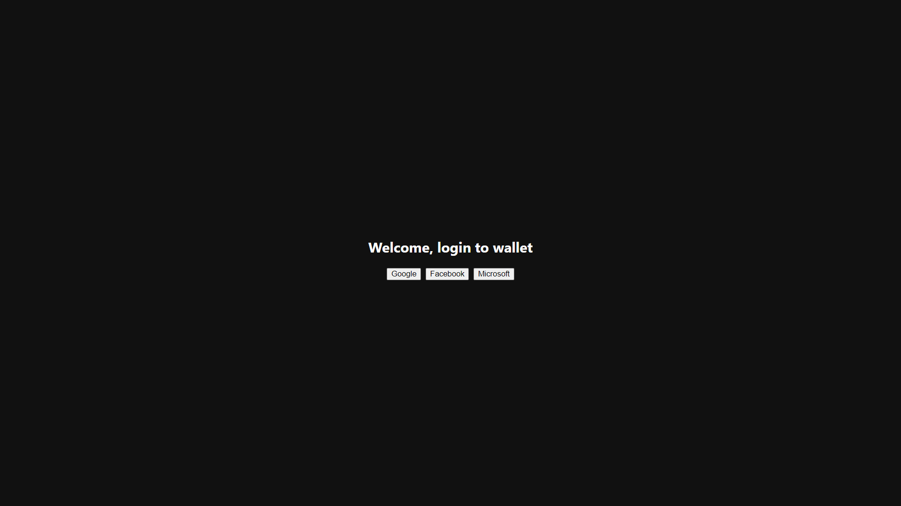
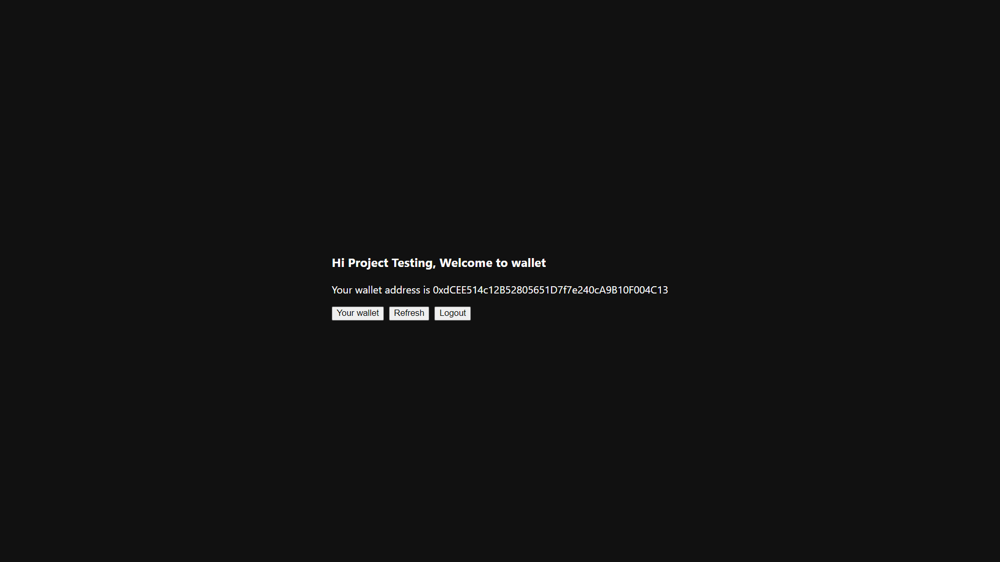
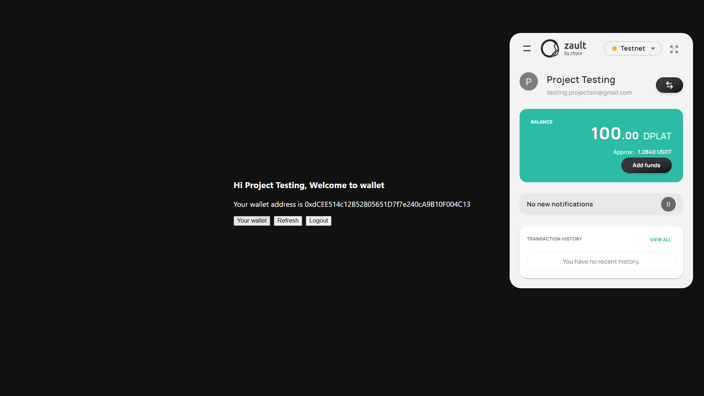
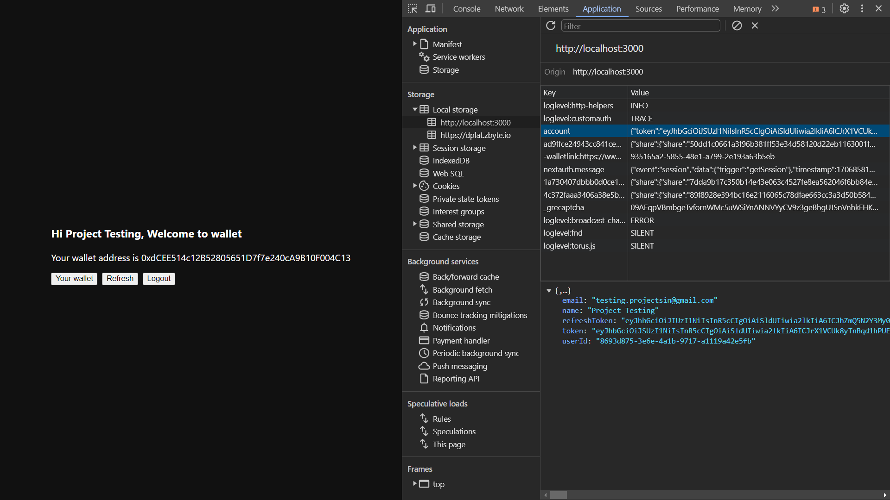

# Wallet Integration using zbyte-sso and zbyte-wallet-ui-sdk

## Getting Started

This application provides example for integration zbyte-sso and zbyte-wallet-ui-sdk with react projects. Users can enjoy an easy, secure and seamless experience of authentication and wallet.






 To ensure smooth onboaring of this, please take note of the following keypoints.

## Important Limitations

- Please use `zbyte-wallet-ui-sdk` compatible React version (17.0.2) for your project.
- Use all other libraries compactible with adjusted react version (e.g. react-dom, etc)
- Use the following command to install the correct version of React:

  ```bash
  npm install react@17.0.2 react-dom@17.0.2
  ```

- Refer to the provided example's `package.json` for guidance on setting up your project.

## Example Usage

To understand the implementation details and configurations, explore the src provided in the `src` directory. This example has 2 parts,

- First is the authentication with zbyte-sso (based on keycloak), find its minified library in `src/keycloak` and initialization at `src/context/keycloak.tsx`.
- Second is the wallet initialization in `src/wallet` which further uses `@zbyteio/zbyte-wallet-ui-sdk` library.

The project serves as a practical reference to guide you through the setup and the process of how wallet is authorized and initialized.

## Running the Project

Follow these steps to run the project:

1. Add all environment varibles in `.env` file.
2. Install project dependencies:
   ```bash
   npm install
   ```
3. Start the development server:
   ```bash
   npm start
   ```
4. Open your browser and navigate to http://localhost:3000 to view the application.

## Contributing

Feel free to contribute by reporting issues, suggesting improvements, or submitting pull requests. We appreciate your feedback and collaboration.

## License

This React App is licensed under the [MIT License](LICENSE). Feel free to use and modify it according to your needs.

Happy coding! 🚀
